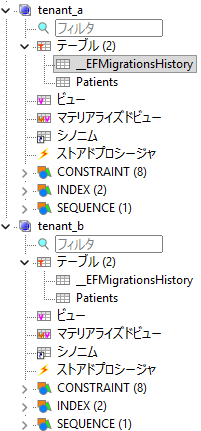
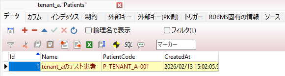
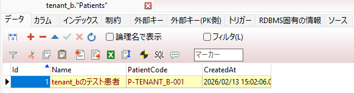
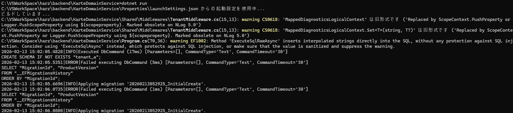

# 技術検証報告書：DBマイグレーションとマルチテナントデータ分離

## 1. 検証の目的

Entity Framework Core（EF Core）を用い、単一のコードベースから動的に作成された複数のPostgreSQLスキーマに対して、テーブル構造および初期データを自動展開できることを実証する。

## 2. 環境構築（インストールしたパッケージ）

本検証にあたり、以下の NuGet パッケージをインストールしました。

| パッケージ名 | バージョン | 用途 |
| --- | --- | --- |
| `Npgsql.EntityFrameworkCore.PostgreSQL` | 最新 | PostgreSQL接続用 |
| `Microsoft.EntityFrameworkCore.Design` | 最新 | マイグレーション実行・設計用 |
| `NLog.Web.AspNetCore` | 最新 | 構造化ログ（JSON）出力用 |

> **使用したツール:** `dotnet-ef` (Global Tool)

## 3. 実装コード（最新版 `Program.cs` 抜粋）

スキーマ作成、`search_path` の切り替え、マイグレーション、データ投入を一気通貫で行う最新のロジックです。

```csharp
using KarteDomainService.Features.Karte.Entities;
using KarteDomainService.Shared.Data;
using KarteDomainService.Shared.Middlewares;
using KarteDomainService.Shared.Services;
using Microsoft.EntityFrameworkCore;
using NLog;
using NLog.Web;

var logger = LogManager.Setup().LoadConfigurationFromAppSettings().GetCurrentClassLogger();
try
{
    var builder = WebApplication.CreateBuilder(args);

    // ロギング設定
    builder.Logging.ClearProviders();
    builder.Host.UseNLog();

    // サービス登録
    builder.Services.AddScoped<ITenantService, TenantService>();
    builder.Services.AddScoped<TenantSchemaInterceptor>();

    // DbContext設定
    builder.Services.AddDbContext<ApplicationDbContext>((serviceProvider, options) =>
    {
        var connectionString = builder.Configuration.GetConnectionString("DefaultConnection");
        options.UseNpgsql(connectionString);
        var interceptor = serviceProvider.GetRequiredService<TenantSchemaInterceptor>();
        options.AddInterceptors(interceptor);
    });

    builder.Services.AddControllers();
    builder.Services.AddOpenApi();

    var app = builder.Build();

    // ミドルウェア設定
    app.UseMiddleware<ExceptionMiddleware>();
    app.UseMiddleware<TenantMiddleware>();

    if (app.Environment.IsDevelopment()) { app.MapOpenApi(); }
    app.UseHttpsRedirection();
    app.UseAuthorization();
    app.MapControllers();

    // --- DB初期化およびマイグレーション処理 ---
    using (var scope = app.Services.CreateScope())
    {
        var context = scope.ServiceProvider.GetRequiredService<ApplicationDbContext>();
        var tenants = new[] { "tenant_a", "tenant_b" };

        foreach (var tenant in tenants)
        {
            // 1. スキーマ作成
            await context.Database.ExecuteSqlRawAsync($"CREATE SCHEMA IF NOT EXISTS \"{tenant}\";");

            // 2. 接続を開き、search_pathをセットしてマイグレーション
            var connection = context.Database.GetDbConnection();
            if (connection.State != System.Data.ConnectionState.Open) await connection.OpenAsync();
            
            using (var command = connection.CreateCommand())
            {
                command.CommandText = $"SET search_path TO \"{tenant}\";";
                await command.ExecuteNonQueryAsync();
            }

            await context.Database.MigrateAsync();

            // 3. テストデータの投入
            if (!await context.Patients.AnyAsync())
            {
                context.Patients.Add(new Patient {
                    Name = $"{tenant}のテスト患者",
                    PatientCode = $"P-{tenant.ToUpper()}-001"
                });
                await context.SaveChangesAsync();
            }
        }
        // セッションをリセット
        await context.Database.ExecuteSqlRawAsync("SET search_path TO public;");
    }

    app.Run();
}
catch (Exception exception)
{
    logger.Error(exception, "Stopped program because of exception");
    throw;
}
finally { LogManager.Shutdown(); }

```

---

## 4. 検証結果エビデンス添付欄

### 【エビデンス1：DBスキーマ構造】

   

* **確認事項**: `tenant_a`, `tenant_b` スキーマ内に `Patients` および `__EFMigrationsHistory` が存在すること。

### 【エビデンス2：投入データ確認】

   
   

* **確認事項**: それぞれのスキーマに、対応する名前の患者データが保存されていること。

### 【エビデンス3：アプリケーションログ】

   

* **確認事項**: `Applying migration '2026XXXXXXXX_InitialCreate'` が各テナントに対して実行されていること。

---

## 5. 結論

本実装により、マルチテナント環境におけるDB定義の自動同期（マイグレーション）とデータ分離の基盤構築が完了した。これにより、テナント数が増加した場合でも、スキーマ名を追加するだけで安全かつ迅速に環境展開が可能である。