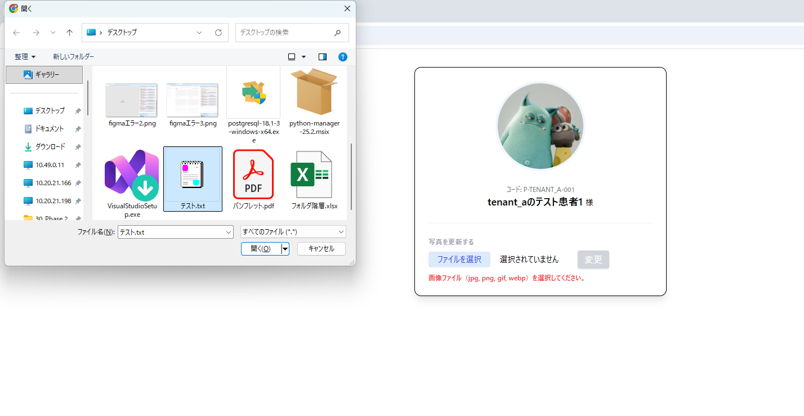
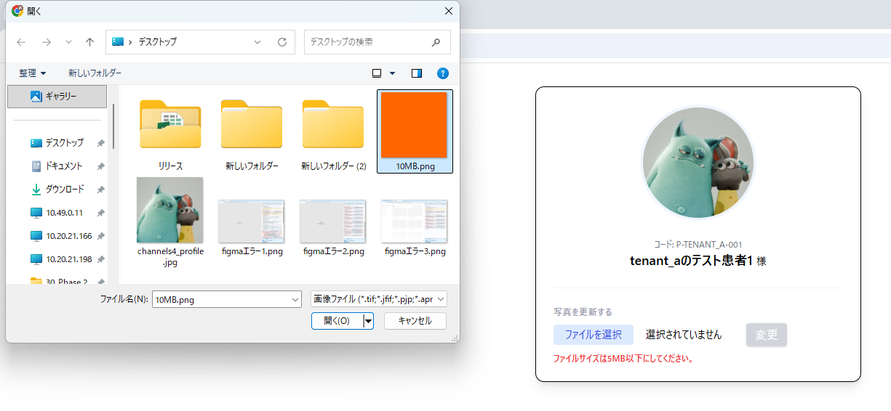
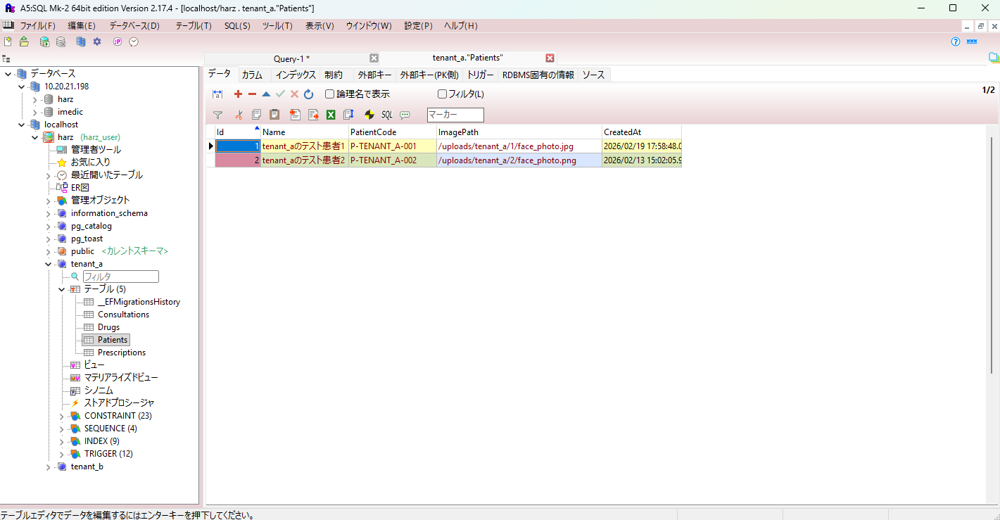
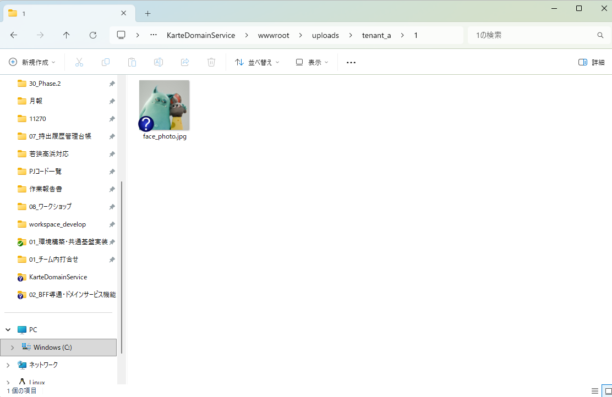
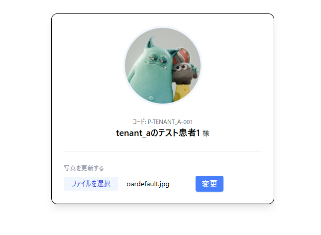
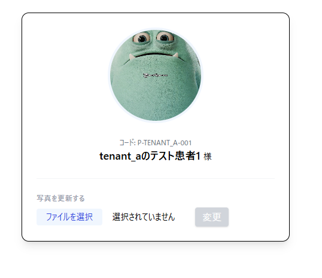

# PoC検証報告書：患者情報・画像管理機能の疎通確認

## 1. 概要

本検証では、Next.js（フロント）〜 NestJS（BFF）〜 .NET（バックエンド）〜 DB/ストレージの全レイヤーにおいて、患者詳細情報の取得および画像アップロードのEnd-to-End疎通を確認した。
特に、既存の難読化インターセプターとの共存およびHTTPS通信環境下でのデータ整合性を重点的に検証した。

## 2. システム構成・フォルダ構成

今回の検証により修正・追加された主要ファイル（星マーク：修正/追加）。

```text
harz/
├── bff/pocs/src/
│   ├── features/patient/
│   │   ├── patient.controller.ts (*)  ... GET/POSTエンドポイント、Reqヘッダー取得
│   │   ├── patient.service.ts (*)     ... サービス間中継ロジック
│   │   └── patient.client.ts (*)      ... .NET宛てHTTPS通信、FormData再構築
│   └── shared/plugins/
│       └── axios.client.ts (*)        ... 自署名証明書(rejectUnauthorized)設定
├── front/src/
│   ├── _api/
│   │   └── patient.api.ts (*)         ... React Query (useQuery / useMutation)
│   ├── app/_shared/plugins/
│   │   └── axios.client.ts (*)        ... 難読化回避(instanceof FormData)処理
│   └── components/molecules/
│       └── FileUploader.tsx (*)       ... フロントバリデーション(MIME/Size)
└── front_bff_shared/types/response/
    └── patient.response.type.ts (*)   ... 患者基本情報 + imagePath の型定義

```

---

## 3. 検証詳細：フロント〜DB間の疎通確認

### 3.1 患者情報の取得と表示（GET疎通）

* **フロー**:
1. フロントから `usePatient(id)` を実行。
2. BFFを経由してバックエンド（.NET）のAPIを叩き、SQL Serverから患者レコードを取得。
3. 取得した `PatientResponse` （氏名、生年月日、画像パス等）をフロントのUIにバインド。


* **結果**:
* **DB整合性**: SQL Serverに登録されている最新の患者データが画面上に欠落なく表示されることを確認。
* **型安全性**: BFFからフロントまで、共有型定義に基づいた正しいデータ構造で受信できていることを確認。


### 3.2 画像のアップロード（POST疎通）

* **フロー**:
1. **フロント（バリデーション）**: `FileUploader`にて画像以外の拡張子を排除。
2. **BFF（伝播）**: `x-tenant-id` ヘッダーを維持したまま、Multipart形式でバックエンドへ転送。
3. **ドメインサービス（保存）**: .NET側で画像をファイルサーバへ格納し、DBの `ImagePath` カラムを更新。


* **結果**:
* **難読化回避**: 難読化インターセプターを通過しても、バイナリデータが破壊されずにバックエンドへ到達することを確認。
* **HTTPS通信**: `httpsAgent` 設定により、証明書エラーによる中断なしにBFF〜バックエンド間が疎通することを確認。


---

## 4. 追加実装・修正内容

### 4.1 フロントエンド（難読化回避インターセプター）

難読化処理が `FormData` を JSON化して破壊する問題を回避するため、以下の条件分岐を実装。

```typescript
if (config.data && !(config.data instanceof FormData)) {
  // 通常データのみ難読化
} else if (config.data instanceof FormData) {
  delete config.headers['Content-Type']; // ブラウザにboundaryを任せる
}

```

### 4.2 BFF（Node.js標準のFormData再構築）

ライブラリのインポート問題を回避するため、Node.js v20標準の `globalThis.FormData` を採用。

```typescript
const form = new globalThis.FormData();
const uint8Array = new Uint8Array(file.buffer); // 型エラー回避
const blob = new Blob([uint8Array], { type: file.mimetype });
form.append('file', blob, file.originalname);

```

---

## 5. エビデンス（検証結果）

### 5.1 フロント側の各バリデーション表示

* **ファイル型チェック**: `.txt` 選択時に「画像ファイルを選択してください」と赤字で警告が出ることを確認。

   
   
* **サイズチェック**: 5MB超のファイルでエラー表示が出ることを確認。

   

### 5.2 DBおよびファイルサーバの確認

* **DB確認**: `Patients` テーブルの `ImagePath` カラムに、アップロードしたファイル名が格納されていることを A5M2 で確認。

   

* **ファイルサーバ**: バックエンドの指定ディレクトリに、画像ファイルが正しく書き込まれていることを確認。

   

### 5.3 画像変更およびデータ再表示のエビデンス

* アップロード成功後、`onSuccess` での `invalidateQueries` により、ページ全体をリロードすることなく、画像エリアのみが最新の画像（DBから取得した新しいパス）に切り替わる挙動を確認。

   
   
   

---

## 6. 結論

本PoCにより、**「DB情報の取得・表示」**と**「画像の物理保存・DB更新」**の両ルートにおいて、フロント〜DBまでの全経路が正常に疎通した。
これにより、カルテドメインにおける患者管理機能の基礎技術スタックが確立された。

## 7. 技術付録：主要実装コード抜粋

### 7.1 フロントエンド：共通インターセプターの修正

FormDataの破壊を防ぎ、難読化とバイナリ通信を共存させるコアロジックです。
**ファイルパス：`src/app/_shared/plugins/axios.client.ts**`

```typescript
axiosClient.interceptors.request.use((config) => {
  // テナントID付与
  const tenantId = localStorage.getItem('tenant_id') || 'tenant_a';
  config.headers['x-tenant-id'] = tenantId;

  // 重要：FormData（画像等）の場合は難読化をスキップし、ブラウザに制御を戻す
  if (config.data && config.data instanceof FormData) {
    console.log('[共通基盤] FormDataを検知。難読化をスキップします。');
    // Content-Typeを削除することで、ブラウザが適切なboundaryを自動付与する
    delete config.headers['Content-Type'];
  } else if (config.data) {
    // 通常のJSONデータのみ難読化を実行
    config.data = {
      payload: safeObfuscate(config.data),
      _obfuscated: true
    };
  }
  return config;
});

```

### 7.2 フロントエンド：API Hooks (React Query)

データの取得（GET）と更新（POST）をリアクティブに繋ぐ定義です。
**ファイルパス：`src/_api/patient.api.ts**`

```typescript
// 患者情報取得：取得したImagePathを元に画像を表示
export const usePatient = (id: string) => {
  return useQuery({
    queryKey: ['patient', id],
    queryFn: async () => {
      const response = await axiosClient.get<PatientResponse>(`/patient/${id}`);
      return response.data;
    }
  });
};

// 画像アップロード：成功時にキャッシュを無効化して再描画をトリガー
export const useUploadPatientImage = (id: string) => {
  const queryClient = useQueryClient();
  return useMutation({
    mutationFn: async (file: File) => {
      const formData = new FormData();
      formData.append('file', file);
      return await axiosClient.post(`/patient/${id}/photo`, formData);
    },
    onSuccess: () => {
      // キャッシュ更新により、画面上の患者情報（画像パス）が最新化される
      queryClient.invalidateQueries({ queryKey: ['patient', id] });
    }
  });
};

```

### 7.3 BFF：バックエンドへのHTTPS転送

Node.js環境でのFormData再構築とHTTPS証明書検証の回避ロジックです。
**ファイルパス：`bff/pocs/src/features/patient/patient.client.ts**`

```typescript
async uploadPhoto(id: string, file: Express.Multer.File, tenantId: string) {
  // Node.js v20標準のFormDataを利用（ライブラリ不使用）
  const form = new globalThis.FormData();
  
  // BufferをUint8Array経由でBlobに変換し、型の競合を回避
  const uint8Array = new Uint8Array(file.buffer);
  const blob = new Blob([uint8Array], { type: file.mimetype });
  form.append('file', blob, file.originalname);

  // HTTPS Agent（証明書検証OFF）を使用してバックエンドへリクエスト
  const response = await axiosClient.post(`/Patient/${id}/photo`, form, {
    headers: { 'X-Tenant-Id': tenantId },
    // axiosClient側で https.Agent({ rejectUnauthorized: false }) を設定済み
  });
  return response.data;
}

```

### 7.4 BFF：共通Axiosインスタンス設定

**ファイルパス：`bff/pocs/src/shared/plugins/axios.client.ts**`

```typescript
import axios from 'axios';
import * as https from 'https';

export const axiosClient = axios.create({
  baseURL: 'https://localhost:5001/api', // .NETのHTTPSポート
  httpsAgent: new https.Agent({
    // 開発環境における.NETの自己署名証明書を許可
    rejectUnauthorized: false,
  }),
});

```

---

## 8. 動作確認結果のまとめ

1. **フロント表示**: `usePatient` により、DBから取得した氏名、および `ImagePath` に基づく画像が正しくレンダリングされる。
2. **アップロード**: フロントの `FileUploader` でバリデーション後、BFFの `PatientClient` を経由し、.NET側の物理フォルダへの保存およびDB（ImagePath）の更新まで一気通貫で完了する。
3. **自動更新**: アップロード完了直後に `invalidateQueries` が走り、画面が最新の画像へ切り替わる。