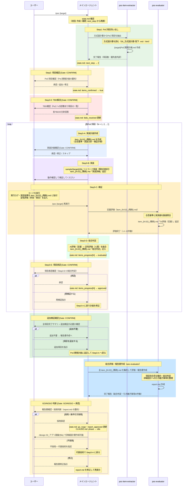

# /poc コマンド シーケンス図

## エージェント役割定義

| エージェント | 役割 | 担当作業 |
|---|---|---|
| **メインエージェント** | 判断・対話 | ユーザーとの対話、Gate判断、state.md管理、item_{N:02}_{略称}.md作成・総合判定 |
| **poc-item-extractor** | 調査（委譲先） | 方式設計書を読み込みPoC項目を抽出 → `{target}PoC開発計画.md` を作成 |
| **poc-evaluator** | 検証（委譲先） | 実行結果と合否基準を数値照合（モード1: item_NN.md 記入）/ 総合評価・報告書作成（モード2: report.md） |

### メインエージェントにPoC実装させる意図

アプリ基盤のPoCは技術選定の核となる工程であり、**ユーザーとの対話を密に保ちながら実装を進める**ことを優先する。
そのため、実装（Step3-B）・判定（Step3-D）・状態管理（state.md）はメインエージェントが直接担う。

> 詳細設計フェーズ（`/design`）や機能実装フェーズ（`/implement`）では、
> 作成・検証の多くをサブエージェントへ委譲してよい。

---

