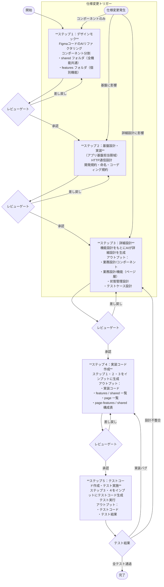

# FE設計ー実装ーテストーフロー

以下にFEの詳細設計から実装、テストにおけるフロー案を記載する。  
各ステップはすべてAI駆動を前提とする。  
また、新規開発以外に、仕様変更にも耐えうるようにする。

---

## 前提インプット

フロー開始前に以下を用意する。

| インプット | 状態 | 備考 |
|---|---|---|
| 機能設計ドキュメント | 作成済み（一部マークダウン未変換） | 未変換分はフロー開始前にマークダウン変換を完了させる |
| 詳細設計テンプレート | 要整備 | アーキテクトが初回のみ作成 |
| 詳細設計AIエージェント | 要整備 | アーキテクトが初回のみプロンプト定義 |

---

## Git管理レベル

| ステップ | 成果物 | Git管理レベル |
|---|---|---|
| ステップ１（デザインモック） | リファクタリングコード | コミットのみ（PRレビュー不要） |
| ステップ２（基盤設計） | 規約ドキュメント | ブランチ + PRレビュー |
| ステップ３（詳細設計） | 設計ドキュメント | ブランチ + PRレビュー |
| ステップ４（実装コード） | 実装コード | ブランチ + PRレビュー |
| ステップ５（テストコード） | テストコード・結果 | ブランチ + PRレビュー |

---

## フロー概要

---

## 仕様変更時の対応

仕様変更はいずれのステップ中にも発生しうる。影響範囲に応じて以下のステップへ戻る。

| 影響範囲 | 戻り先 |
|---|---|
| コンポーネントのみ | ステップ１へ |
| 詳細設計に影響 | ステップ３へ |
| 基盤に影響（API変更等） | ステップ２へ |

---

## 各ステップ詳細

### ステップ１：デザインモック

Figmaで作成した実装コードをAIによりリファクタリングし、コンポーネントに分割する。

**フォルダ構成：**
- `shared/`：全機能共通コンポーネント
- `features/`：個別機能コンポーネント

**アウトプット：**
- リファクタリング後の実装コード

**前提：**
- 当該ステップ完了後はFigmaに戻っての変更はしない。

---

### ステップ２：基盤設計・実装（アプリ基盤担当領域）

後続ステップ全体の規約基盤を確立する。

**作業内容：**
- HTTP通信設計
- 開発規約の策定
- 命名規約・コーディング規約の策定

**アウトプット：**
- 基盤設計ドキュメント
- 規約ドキュメント

> **レビューゲート：** アーキテクトによるレビューを経て承認後、次ステップへ進む。
> 主な確認観点：規約の網羅性・チーム合意

---

### ステップ３：詳細設計

機能設計をもとにAIエージェントが詳細設計を生成する。

**アウトプット：**
- 業務設計 / コンポーネント
- 業務設計 / 機能（ページ層）
- 状態管理設計
- テストケース設計

> **レビューゲート：** PO + 開発リードによるレビューを経て承認後、次ステップへ進む。
> 主な確認観点：業務仕様との整合・テストケース妥当性

---

### ステップ４：実装コード作成

ステップ１・２・３をインプットに実装コードを生成する。

**アウトプット：**
- 実装コード
- `features` / `shared` 一覧
- page 一覧
- page-features / shared 構成表

> **レビューゲート：** 開発リードによるレビューを経て承認後、次ステップへ進む。
> 主な確認観点：規約準拠・設計との整合・セキュリティ

---

### ステップ５：テストコード作成・テスト実施

ステップ３・４をインプットにテストコードを生成し、テストを実行する。

**テストツール：**

| フェーズ | ツール | 用途 |
|---|---|---|
| ユニット・統合 | Jest / Vitest + React Testing Library | ロジック・コンポーネント単体 |
| UIカタログ | Storybook | 目視確認・インタラクションテスト（後工程での人手テストも想定） |
| E2E | Playwright | ユーザー操作シナリオ |
| APIモック | MSW（Mock Service Worker） | バックエンド未完時のFE単独テスト |
| API仕様確認 | Swagger（OpenAPI） | バックエンドIF確認（テストツールではない） |

**アウトプット：**
- テストコード
- テスト結果

**テスト失敗時の対応：**
- 実装バグ → ステップ４へ戻る
- 設計不整合 → ステップ３へ戻る
