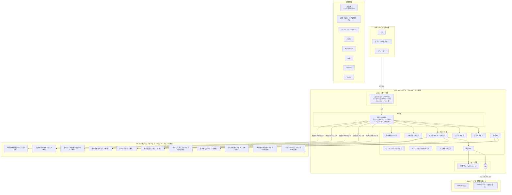

# システム設計

> 最終更新: 2026-03-19

## アーキテクチャパターン

**クラウドネイティブ・マルチテナント型レイヤードアーキテクチャ**

選定理由: 療養型中小病院向けSaaSとして複数医療機関（テナント）に提供するため。
モジュール単位の独立デプロイ・拡張性と、医療業務の複雑な階層（フロントエンド → BFF → バックエンド → ストレージ）を
明確に分離し、保守性と制度改正対応の俊敏性を確保する。

## システム構成図

## レイヤー定義

| レイヤー | 主要コンポーネント | 責務 | 依存してはいけない先 |
|---------|-----------------|------|-------------------|
| フロントエンド | フロントエンド | レンダリング | バックエンド直接アクセス・データベースアクセス |
| BFF | BFF | リクエスト集約・入力バリデーション・ルーティング | データベースへの直接アクセス |
| バックエンド | カルテドメインサービス | 業務ロジック・ドメインルール・データアクセス | フロントエンド |
| ストレージ | データベース | データの永続化・保全 | 全上位レイヤー |

## 主要コンポーネント

| コンポーネント | レイヤー | 責務 |
|-------------|---------|------|
| フロントエンド | フロントエンド | UI表示 |
| BFF | BFF | 入力バリデーション・複数バックエンドへのリクエスト集約・レスポンス整形 |
| カルテドメインサービス | バックエンド | 診療記録・オーダー等の中核業務ロジック |
| 文書作成サービス | バックエンド | 診断書・サマリ等のドキュメント生成 |
| 文書管理サービス | ストレージ | 文書・帳票ファイルの保管 |
| 認証サービス | バックエンド | ID管理・ログイン・セッション・二要素認証 |
| 認可サービス | バックエンド | ロール/権限管理・アクセス制御 |
| ウィルスキャンサービス | バックエンド | アップロードファイルのウィルスチェック |
| 電子署名サービス | バックエンド | 帳票に電子署名の付与 |
| KMSサービス | バックエンド | 暗号鍵のライフサイクル管理 |
| 証明書管理サービス | バックエンド | 証明書のライフサイクル管理 |
| ヘルプサイトサービス | バックエンド | ヘルプ・マニュアルコンテンツの管理 |
| 外部連携サービス | バックエンド | 外部サービスとの連携制御 |
| タイムスタンプサービス | バックエンド | タイムスタンプの付与 |
| 直接印刷サービス | バックエンド | 帳票・文書のダイレクト印刷 |
| データ分析サービス | バックエンド | 統計・経営ダッシュボード |
| 利用者一元管理サービス | バックエンド | テナント横断ユーザー管理 |
| グループウェアサービス | バックエンド | 院内コミュニケーション支援 |
| DB | ストレージ | 診療データの永続化（テナント間論理分離） |
| S3 Object Lock (Parquet) | ストレージ | 監査ログの長期保存（改ざん防止・WORM・列指向形式） |
| Zabbix | 運用基盤 | インフラ・ネットワークの死活監視・アラート通知 |
| Prometheus | 運用基盤 | アプリケーション・サービスのメトリクス収集 |
| Loki | 運用基盤 | ログ集約・検索 |
| Grafana | 運用基盤 | メトリクス・ログの可視化ダッシュボード |
| Vector | 運用基盤 | ログ・メトリクスの収集・変換・ルーティング |
| GitLab | 運用基盤 | ソース管理・CI/CDパイプライン |
| BCPサービス | BCP | 障害時のサービス継続・セカンダリDC切り替え |

## 外部システム連携

| 外部システム | 区分 | 用途 | 通信方式 |
|-------------|------|------|---------|
| 医事会計システム | 連携のみ | 診療報酬算定・レセプト連携 | API |
| 部門システム（検査/薬剤/リハ等） | 連携のみ | オーダー送信・結果受信 | HL7 JAHIS |
| 電子カルテ情報共有サービス | 連携のみ | 医療機関間の情報共有 | HL7 FHIR |
| 電子処方箋管理サービス | 連携のみ | 電子処方箋の発行・管理 | HL7 FHIR |
| 地域医療連携システム | 連携のみ | 地域包括ケア連携 | 未定 |
| PACS | 連携のみ | 医用画像の保管・配信 | API |

## 制約・前提

- マルチテナント構成。テナント（医療機関）間のデータはスキーマで論理分離
- 通信は TLS 1.3以上で暗号化。インターネット経由は VPN または閉域網を使用
- データは国内DCに保存（AES-256暗号化）
- 既存の方式設計書・PoC設計（2021年度〜）との整合性を維持すること
- 2025年度は外来業務を中心に実装。入院病棟業務は2026年度
