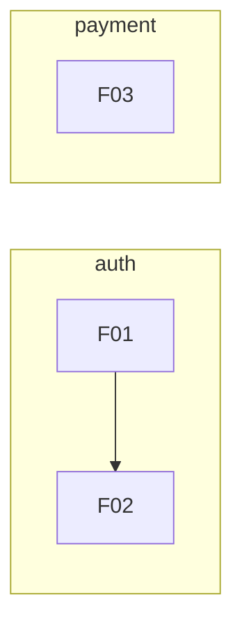

# 機能一覧（Feature Index）

> 最終更新: YYYY-MM-DD

## 機能一覧

**このファイルが全機能の状態管理の正（Single Source of Truth）。**

| ID | ドメイン | 機能名 | ステータス | 依存 | 概要 |
|----|---------|--------|-----------|------|------|
| F01 | auth | {{機能名}} | design / implement / done | — | {{1行の説明}} |
| F02 | auth | {{機能名}} | design | F01 | {{1行の説明}} |
| F03 | payment | {{機能名}} | implement | — | {{1行の説明}} |

### ステータス定義

| ステータス | 意味 |
|-----------|------|
| design | 設計中（PRD/設計書作成中） |
| implement | 実装中 |
| done | 完了（レビュー通過済み） |

**複数の機能が同時に design / implement 状態であってよい。**
CLAUDE.md の `active_feature` は「今のセッションで作業中の機能」を示す。
全機能のステータスはこの INDEX.md で管理する。

## ドメイン一覧

| ドメイン | 説明 | パス |
|---------|------|------|
| {{auth}} | {{認証・認可}} | `docs/spec/auth/` |
| {{payment}} | {{決済}} | `docs/spec/payment/` |

※ ドメインは機能の論理的グループ。1ドメイン = 1ディレクトリ。

## 依存関係図（機能が増えたら更新）

## 採番ルール

- 連番（F01, F02, ...）。ドメインをまたいでもグローバル連番
- 欠番は埋めない（削除された機能のIDは再利用しない）
- 機能名は kebab-case（例: `user-auth`, `payment-flow`）
- ドメイン名は kebab-case（例: `auth`, `user-management`）
